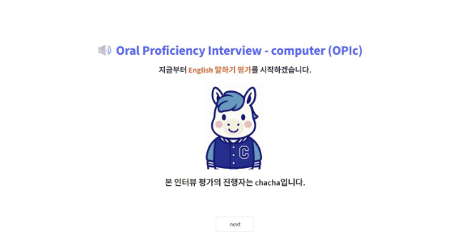

# 🎙️ OPIc Buddy

> **맞춤 OPIc 모의고사 서비스**  
> 생성형 인공지능을 활용한 실시간 맞춤 오픽 모의고사

**2025 CNU 생성형 인공지능 챌린지** | 충남대학교 경영학부 what Lab

---

## 📌 프로젝트 소개

OPIc(Oral Proficiency Interview - computer)은 면대면 인터뷰인 OPI를 최대한 인터뷰와 가깝게 만든 iBT 기반의 응시자 친화형 외국어 말하기 평가입니다. 실제 생활에서 얼마나 효과적이고 적절하게 언어를 사용할 수 있는지를 측정하는 언어 평가 도구로, 삼성, LG, POSCO, 한화, 한진, 두산 등 **약 1,700개 기업**의 채용 및 인사/교육평가에 활용되고 있습니다.

**OPIc Buddy**는 사전 서베이 기반으로 개인화된 문제를 생성하여 학습 효율을 높이는 AI 모의고사 서비스입니다.

---

## 🔍 문제 인식

오픽 시험에서 출제되는 문제는 **사전 서베이에 따라 개인화**되어 제공됩니다.  
그러나 기존의 학습 방법(학원, 동영상 강의, 문제집)에서는 교재 내용 중 **학습자의 서베이와 일치하는 부분이 작아 학습 효율이 저하**되는 문제가 있습니다.

> 💡 **해결 방향**: 개인화된 문제를 "생성"하여 학습 효율을 높이자!

---

## ✨ 주요 기능

### 1️⃣ Background Survey — 서베이 기반 관심사·난이도 설정

- 5단계 Background Survey를 통해 직업, 학생 여부, 거주 환경, 취미 등 개인 정보 수집
- 서베이 결과를 JSON으로 변환하여 개인 맞춤 문항 출제에 활용

### 2️⃣ 서베이 기반 OPIc 모의고사 진행

- OpenAI API(GPT-4o-mini)를 활용한 **음성 질문** 제공 (TTS: tts-1)
- 음성(최대 60초) 또는 텍스트로 답변 가능
- OpenAI Whisper API를 활용한 **음성 인식(STT)**

### 3️⃣ OPIc 점수 예측 & 답변 피드백 제공

- 사용자 응답을 기반으로 **OPIc 점수 예측** (NL ~ AL)
- 문항별 상세 피드백 (강점 / 개선사항 / 개선된 모범답안 제공)
- 종합 평가 및 **학습 추천사항** 제공

---

## 🏗️ 시스템 아키텍처

```
USER
 │
 ▼
SURVEY (Streamlit)
 │
 ▼ JSON
문제 생성기 (OpenAI API - GPT-4o-mini)
 ├── STT: OpenAI Whisper API  ──► [사용자 음성 답변]
 └── TTS: OpenAI tts-1        ──► [음성 질문 출력]
 │
 ▼
성적 예측 및 피드백 제공
 ▲
 │ RAG (Hallucination 방지)
기출 문제 증강
 ├── OPIc 가이드북
 └── OpenAI API (GPT-3.5-turbo) ──► Store ──► MongoDB
```

| 구성 요소 | 기술 스택 |
|---|---|
| 프론트엔드 | Streamlit |
| 문제 생성 | OpenAI GPT-4o-mini |
| 기출 증강 (RAG) | OpenAI GPT-3.5-turbo + MongoDB |
| 음성 인식 (STT) | OpenAI Whisper API |
| 음성 합성 (TTS) | OpenAI tts-1 |
| 데이터베이스 | MongoDB |

---

## 🔄 유저 플로우

```
① Background Survey 진행
        ↓
② 서베이 기반 OPIc 모의고사 진행 (15문항)
        ↓
③ OPIc 점수 예측 및 피드백 확인
```

## 📌서비스 화면 소개

.png)
.png)
---

## 📊 OPIc 등급 체계

| 등급 | 세부 |
|---|---|
| Advanced | Low |
| Intermediate | High / Mid 3 / Mid 2 / Mid 1 / Low |
| Novice | High / Mid / Low |

> 충남대학교 영어능력인정 기준: **IM3 이상**  
> 공기업(KOTRA, 한국과기연 등) 취업 가산점 기준: **IH ~ IM2 이상**

---

## 💡 향후 계획

- **Self Assessment 반영 문제 생성**: 실제 오픽 시험처럼 1~6까지의 자기 평가 레벨을 반영한 문제 출제
- 충남대학교 국제언어교육센터 연계 **모의 오픽 시험 진행**
- 학생 영어 실력 평가 도구로 활용하여 **적정 난이도 어학강좌 배치**
- 리딩·리스닝 중심 학습에서 벗어나 **스피킹 중심 학습**으로 전환 지원

---

## 💰 비용

- 1회 모의고사 출제 시 평균 **96회의 OpenAI API Request** 발생
- Token 크기에 따라 다르지만 약 **$0.05** 수준

---

## 👥 팀원 소개

| 이름 | 소속 | 역할 |
|---|---|---|
| 오서현 | 경영학부 4학년 | 프론트 개발, 서베이 문항 정리 |
| 이학림 | 경영학부 3학년 | RAG 개발, 데이터 증강 |
| 이재환 | 경영학부 조교수 | 잔소리 및 참견 |

---

## 🎯 서비스 슬로건

> **"맞춤으로, 언제든지, 충분하게**  
> **오픽 연습하고 한번에 합격하자"**
